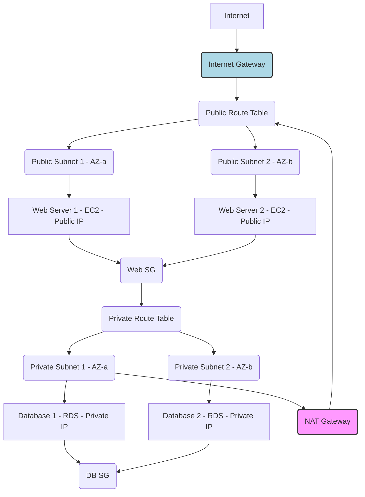

AWS VPC (Virtual Private Cloud) is a fundamental service that allows you to launch AWS resources into a virtual network that you've defined. This virtual network is logically isolated from other virtual networks in the AWS Cloud. It gives you complete control over your virtual networking environment, including selection of your own IP address range, creation of subnets, and configuration of route tables, network gateways, and security settings.

---

# AWS Virtual Private Cloud (VPC)

## Table of Contents

1.  [What is AWS VPC?](#1-what-is-aws-vpc)
2.  [Why Use VPC? (Benefits)](#2-why-use-vpc-benefits)
3.  [Core VPC Components](#3-core-vpc-components)
    *   [VPC](#31-vpc)
    *   [Subnets](#32-subnets)
    *   [Route Tables](#33-route-tables)
    *   [Internet Gateway (IGW)](#34-internet-gateway-igw)
    *   [NAT Gateway](#35-nat-gateway)
    *   [Security Groups (SGs)](#36-security-groups-sgs)
    *   [Network Access Control Lists (NACLs)](#37-network-access-control-lists-nacls)
    *   [VPC Peering](#38-vpc-peering)
    *   [VPC Endpoints](#39-vpc-endpoints)
4.  [Default VPC vs. Custom VPC](#4-default-vpc-vs-custom-vpc)
5.  [Example Scenario: Building a Two-Tier Web Application VPC](#5-example-scenario-building-a-two-tier-web-application-vpc)
    *   [Architecture Goal](#architecture-goal)
    *   [Conceptual Steps & AWS CLI Input](#conceptual-steps--aws-cli-input)
    *   [Expected Output (Conceptual)](#expected-output-conceptual)
    *   [Testing Connectivity](#testing-connectivity)
6.  [Best Practices](#6-best-practices)
7.  [Conclusion](#7-conclusion)

---

## 1. What is AWS VPC?

Imagine you want to build a house (your application) in a large city (AWS Cloud). You don't just put your house directly on a street; you first buy a plot of land, fence it, maybe add a security gate, and then build your house inside.

In AWS, your "plot of land" is a **Virtual Private Cloud (VPC)**. It's a logically isolated section of the AWS Cloud where you can launch AWS resources in a virtual network that you define. You have complete control over this virtual networking environment, including:

*   **IP address range:** You choose your own IP address space.
*   **Subnets:** Divide your VPC into smaller network segments.
*   **Route tables:** Control how traffic flows between subnets and to/from the internet.
*   **Network gateways:** Connect your VPC to the internet, other VPCs, or your on-premises network.
*   **Security settings:** Implement firewalls (Security Groups and Network ACLs) to control access to your resources.

Essentially, VPC allows you to have your own private, isolated, and highly configurable network within AWS.

## 2. Why Use VPC? (Benefits)

*   **Isolation:** Your resources are isolated from other AWS customers, providing a secure and dedicated environment.
*   **Control:** You have full control over network configuration, including IP addressing, routing, and access control.
*   **Security:** granular security policies can be applied at multiple levels (subnet, instance).
*   **Flexibility:** Design complex network architectures to meet specific application requirements (e.g., multi-tier applications, hybrid clouds).
*   **Compliance:** Helps meet various compliance standards by allowing you to segment and control your network.

## 3. Core VPC Components

### 3.1. VPC

The fundamental building block. It's your private network in AWS.

*   **CIDR Block (Classless Inter-Domain Routing):** A range of IP addresses for your VPC (e.g., `10.0.0.0/16`). This range determines the maximum number of available IP addresses.
    *   **Example:** A `/16` CIDR block (e.g., `10.0.0.0/16`) allows for 65,536 private IP addresses. AWS reserves 5 IPs per subnet.
*   **Tenancy:** Can be `default` (shared hardware) or `dedicated` (dedicated hardware for your instances).

### 3.2. Subnets

Subnets are segments of your VPC's CIDR block. They divide your VPC into smaller, more manageable networks. Each subnet must reside entirely within one Availability Zone (AZ).

*   **Public Subnet:** A subnet whose route table has a direct route to an Internet Gateway. Instances in a public subnet can have public IP addresses and communicate directly with the internet.
*   **Private Subnet:** A subnet whose route table does *not* have a direct route to an Internet Gateway. Instances in a private subnet do not have direct internet access, but can access the internet via a NAT Gateway if configured. Ideal for databases and application servers.

### 3.3. Route Tables

A route table contains a set of rules, called routes, that determine where network traffic from your subnet or gateway is directed. Each subnet must be associated with a route table.

*   **Local Route:** Automatically created for every route table. It enables communication within the VPC (between subnets).
    *   **Destination:** `10.0.0.0/16` (your VPC CIDR)
    *   **Target:** `local`
*   **Custom Routes:** Added manually to direct traffic to specific targets like:
    *   Internet Gateway (for internet access)
    *   NAT Gateway (for outbound internet access from private subnets)
    *   VPC Peering connection (to another VPC)
    *   VPN connection or Direct Connect (to on-premises networks)

### 3.4. Internet Gateway (IGW)

A horizontally scaled, redundant, and highly available VPC component that allows communication between instances in your VPC and the internet. It provides a target for internet-bound traffic in your route tables.

*   You can have only one IGW attached to a VPC.
*   **Function:** Enables public IP addresses on instances (or Elastic IPs) to be reachable from the internet, and allows instances to reach the internet.

### 3.5. NAT Gateway

(Network Address Translation) A managed service that allows instances in a private subnet to connect to the internet or other AWS services, but prevents the internet from initiating a connection with those instances.

*   **Placement:** Must be deployed in a **public subnet**.
*   **Elastic IP:** Requires an Elastic IP address.
*   **Function:** Translates the private IP addresses of instances in a private subnet to the NAT Gateway's public IP address for outbound traffic.
*   **Alternative:** NAT Instance (self-managed EC2 instance), but NAT Gateway is preferred for its higher availability, bandwidth, and zero administration.

### 3.6. Security Groups (SGs)

Act as a virtual firewall for your EC2 instances (or other resources like RDS, Lambda ENIs).

*   **Instance-level:** Rules apply directly to instances.
*   **Stateful:** If you send an outbound request, the response traffic is automatically allowed, regardless of inbound rules.
*   **Allow-list only:** You can only specify `allow` rules. Any traffic not explicitly allowed is implicitly denied.
*   **Rules:** Consist of protocol (TCP, UDP, ICMP), port range, and source/destination IP address or another Security Group.

### 3.7. Network Access Control Lists (NACLs)

An optional layer of security for your VPC that acts as a firewall for controlling traffic in and out of one or more subnets.

*   **Subnet-level:** Rules apply to all instances within a subnet.
*   **Stateless:** If you allow inbound traffic, you must explicitly allow outbound response traffic (and vice-versa).
*   **Allow and Deny rules:** You can specify both `allow` and `deny` rules.
*   **Rule evaluation:** Rules are evaluated in order, from lowest number to highest. Once a match is found, it's applied.
*   **Default NACL:** Allows all inbound and outbound traffic.

| Feature         | Security Group (SG)               | Network ACL (NACL)                        |
| :-------------- | :-------------------------------- | :---------------------------------------- |
| **Level**       | Instance                          | Subnet                                    |
| **Rules**       | Allow-only                        | Allow and Deny                            |
| **Statefulness**| Stateful                          | Stateless (must define both in/out)       |
| **Default**     | Denies all inbound, allows all outbound | Allows all inbound and outbound           |
| **Evaluation**  | All rules evaluated, most permissive rule applies | Rules evaluated in order (lowest to highest) |

### 3.8. VPC Peering

Allows you to connect two VPCs together so that they can communicate as if they are on the same network.

*   **Non-transitive:** If VPC A is peered with VPC B, and VPC B is peered with VPC C, VPC A and VPC C cannot communicate directly unless A and C are also peered.
*   **Same/Different Accounts:** Can be between VPCs in the same AWS account or different AWS accounts.
*   **Same/Different Regions:** Can be between VPCs in the same AWS region or different regions (Inter-Region VPC Peering).

### 3.9. VPC Endpoints

Enable you to privately connect your VPC to supported AWS services (e.g., S3, DynamoDB, SQS, SNS) and VPC endpoint services powered by AWS PrivateLink, without requiring an internet gateway, NAT device, VPN connection, or AWS Direct Connect connection. Instances in your VPC use private IP addresses to communicate with the service.

*   **Gateway Endpoints:** For S3 and DynamoDB. Routes requests to the service via a gateway.
*   **Interface Endpoints:** For most other AWS services (e.g., EC2, SQS, SNS, Kinesis, CloudWatch Logs). Powered by AWS PrivateLink. Creates an Elastic Network Interface (ENI) in your subnet.

---

## 4. Default VPC vs. Custom VPC

*   **Default VPC:**
    *   Automatically created in each region when your AWS account is provisioned.
    *   Comes with a public subnet in each AZ, an IGW, and associated route tables and NACLs.
    *   Easy to get started, good for basic use cases.
    *   CIDR block is usually `172.31.0.0/16`.
*   **Custom VPC:**
    *   You define everything: CIDR block, subnets, route tables, security, etc.
    *   Recommended for production environments, complex architectures, and when you need specific IP ranges or network isolation.

**Always use a Custom VPC for production workloads.**

---

## 5. Example Scenario: Building a Two-Tier Web Application VPC

Let's design a VPC for a simple web application:
*   **Tier 1 (Web Servers):** Public-facing, accessible from the internet, deployed in a public subnet.
*   **Tier 2 (Database):** Private, not directly accessible from the internet, deployed in a private subnet.
*   Web servers need to talk to the database.
*   Database needs to access the internet for updates (e.g., software patches).

### Architecture Goal



**VPC Configuration:**
*   **VPC CIDR:** `10.0.0.0/16`
*   **Public Subnets (2 across AZs):**
    *   `10.0.1.0/24` (e.g., `us-east-1a`)
    *   `10.0.2.0/24` (e.g., `us-east-1b`)
*   **Private Subnets (2 across AZs):**
    *   `10.0.3.0/24` (e.g., `us-east-1a`)
    *   `10.0.4.0/24` (e.g., `us-east-1b`)
*   **Internet Gateway (IGW):** For public subnets.
*   **NAT Gateway:** In one public subnet, for private subnets' outbound internet access.
*   **Route Tables:**
    *   One for public subnets (default route `0.0.0.0/0` to IGW).
    *   One for private subnets (default route `0.0.0.0/0` to NAT Gateway).
*   **Security Groups:**
    *   `Web_SG`: Allow HTTP/HTTPS from `0.0.0.0/0`, SSH from your IP.
    *   `DB_SG`: Allow database port (e.g., 3306 for MySQL) from `Web_SG`.

### Conceptual Steps & AWS CLI Input

(Note: Replace placeholder IDs like `<vpc-id>`, `<subnet-id>`, etc., with actual values returned by previous commands. Also, specify your AWS region.)

**1. Create VPC**
```bash
# Input: Create a VPC with a /16 CIDR block
aws ec2 create-vpc --cidr-block 10.0.0.0/16 --tag-specifications 'ResourceType=vpc,Tags=[{Key=Name,Value=MyWebAppVPC}]'
```

**2. Create Subnets (Public & Private across AZs)**
```bash
# Input: Create public subnets
aws ec2 create-subnet --vpc-id <vpc-id> --cidr-block 10.0.1.0/24 --availability-zone us-east-1a --tag-specifications 'ResourceType=subnet,Tags=[{Key=Name,Value=PublicSubnet-AZ1}]'
aws ec2 create-subnet --vpc-id <vpc-id> --cidr-block 10.0.2.0/24 --availability-zone us-east-1b --tag-specifications 'ResourceType=subnet,Tags=[{Key=Name,Value=PublicSubnet-AZ2}]'

# Input: Create private subnets
aws ec2 create-subnet --vpc-id <vpc-id> --cidr-block 10.0.3.0/24 --availability-zone us-east-1a --tag-specifications 'ResourceType=subnet,Tags=[{Key=Name,Value=PrivateSubnet-AZ1}]'
aws ec2 create-subnet --vpc-id <vpc-id> --cidr-block 10.0.4.0/24 --availability-zone us-east-1b --tag-specifications 'ResourceType=subnet,Tags=[{Key=Name,Value=PrivateSubnet-AZ2}]'
```

**3. Create and Attach Internet Gateway (IGW)**
```bash
# Input: Create IGW
aws ec2 create-internet-gateway --tag-specifications 'ResourceType=internet-gateway,Tags=[{Key=Name,Value=MyWebAppVPC-IGW}]'

# Input: Attach IGW to VPC
aws ec2 attach-internet-gateway --vpc-id <vpc-id> --internet-gateway-id <igw-id>
```

**4. Create Public Route Table and Configure**
```bash
# Input: Create a route table for public subnets
aws ec2 create-route-table --vpc-id <vpc-id> --tag-specifications 'ResourceType=route-table,Tags=[{Key=Name,Value=PublicRouteTable}]'

# Input: Add route to IGW
aws ec2 create-route --route-table-id <public-rt-id> --destination-cidr-block 0.0.0.0/0 --gateway-id <igw-id>

# Input: Associate public subnets with the public route table
aws ec2 associate-route-table --subnet-id <public-subnet-1-id> --route-table-id <public-rt-id>
aws ec2 associate-route-table --subnet-id <public-subnet-2-id> --route-table-id <public-rt-id>
```

**5. Create NAT Gateway (for Private Subnet Internet Access)**
```bash
# Input: Allocate an Elastic IP for the NAT Gateway
aws ec2 allocate-address --tag-specifications 'ResourceType=elastic-ip,Tags=[{Key=Name,Value=MyWebAppVPC-NAT-EIP}]'

# Input: Create NAT Gateway in one of the public subnets
aws ec2 create-nat-gateway --subnet-id <public-subnet-1-id> --allocation-id <eip-allocation-id> --tag-specifications 'ResourceType=natgateway,Tags=[{Key=Name,Value=MyWebAppVPC-NAT-GW}]'
```

**6. Create Private Route Table and Configure**
```bash
# Input: Create a route table for private subnets
aws ec2 create-route-table --vpc-id <vpc-id> --tag-specifications 'ResourceType=route-table,Tags=[{Key=Name,Value=PrivateRouteTable}]'

# Input: Add route to NAT Gateway (ensure NAT GW is in available state)
aws ec2 create-route --route-table-id <private-rt-id> --destination-cidr-block 0.0.0.0/0 --nat-gateway-id <nat-gw-id>

# Input: Associate private subnets with the private route table
aws ec2 associate-route-table --subnet-id <private-subnet-1-id> --route-table-id <private-rt-id>
aws ec2 associate-route-table --subnet-id <private-subnet-2-id> --route-table-id <private-rt-id>
```

**7. Create Security Groups**
```bash
# Input: Create Web Server Security Group
aws ec2 create-security-group --group-name Web_SG --description "Allow HTTP/S and SSH to web servers" --vpc-id <vpc-id>
aws ec2 authorize-security-group-ingress --group-id <web-sg-id> --protocol tcp --port 80 --cidr 0.0.0.0/0
aws ec2 authorize-security-group-ingress --group-id <web-sg-id> --protocol tcp --port 443 --cidr 0.0.0.0/0
aws ec2 authorize-security-group-ingress --group-id <web-sg-id> --protocol tcp --port 22 --cidr <your-public-ip>/32 # Replace with your IP

# Input: Create Database Security Group
aws ec2 create-security-group --group-name DB_SG --description "Allow DB traffic from Web Servers" --vpc-id <vpc-id>
aws ec2 authorize-security-group-ingress --group-id <db-sg-id> --protocol tcp --port 3306 --source-group <web-sg-id> # Allow from Web_SG
```

**8. Launch EC2 Instances (Web Servers) and RDS Instance (Database)**
```bash
# Input: Launch Web Server EC2 in Public Subnet (example - will need AMI and key-pair)
aws ec2 run-instances --image-id ami-0abcdef1234567890 --instance-type t2.micro --key-name MyKeyPair --security-group-ids <web-sg-id> --subnet-id <public-subnet-1-id> --associate-public-ip-address

# Input: Launch RDS MySQL instance in Private Subnets (example - will need DB name, master password, etc.)
# Note: For RDS, you'll create a DB Subnet Group first, which includes your private subnets.
aws rds create-db-subnet-group --db-subnet-group-name my-db-subnet-group --db-subnet-group-description "Private subnets for RDS" --subnet-ids <private-subnet-1-id> <private-subnet-2-id>

aws rds create-db-instance --db-instance-identifier mydbinstance --db-instance-class db.t2.micro --engine mysql --master-username admin --master-user-password <password> --allocated-storage 20 --db-subnet-group-name my-db-subnet-group --vpc-security-group-ids <db-sg-id> --no-publicly-accessible
```

### Expected Output (Conceptual)

After executing these commands (and waiting for resources to provision):

*   **VPC:**
    *   `VPC ID: vpc-xxxxxxxxxxxxxxxxx`
    *   `CIDR Block: 10.0.0.0/16`
    *   `Name: MyWebAppVPC`
*   **Subnets:**
    *   Four subnets listed, each with its own ID, CIDR block, and AZ.
    *   `PublicSubnet-AZ1 (10.0.1.0/24)`, `PublicSubnet-AZ2 (10.0.2.0/24)`
    *   `PrivateSubnet-AZ1 (10.0.3.0/24)`, `PrivateSubnet-AZ2 (10.0.4.0/24)`
*   **Internet Gateway:**
    *   `IGW ID: igw-xxxxxxxxxxxxxxxxx`
    *   Status: `attached` to `vpc-xxxxxxxxxxxxxxxxx`
*   **Public Route Table:**
    *   `Route Table ID: rtb-xxxxxxxxxxxxxxxxx`
    *   `Routes:`
        *   `10.0.0.0/16 -> local`
        *   `0.0.0.0/0 -> igw-xxxxxxxxxxxxxxxxx`
    *   `Associations:` `public-subnet-1-id`, `public-subnet-2-id`
*   **NAT Gateway:**
    *   `NAT Gateway ID: nat-xxxxxxxxxxxxxxxxx`
    *   `State: available`
    *   `Elastic IP: <your-eip-address>`
    *   `Subnet: <public-subnet-1-id>`
*   **Private Route Table:**
    *   `Route Table ID: rtb-yyyyyyyyyyyyyyyyy`
    *   `Routes:`
        *   `10.0.0.0/16 -> local`
        *   `0.0.0.0/0 -> nat-xxxxxxxxxxxxxxxxx`
    *   `Associations:` `private-subnet-1-id`, `private-subnet-2-id`
*   **Security Groups:**
    *   `Web_SG`: Ingress rules for 80, 443 (from 0.0.0.0/0), 22 (from your IP).
    *   `DB_SG`: Ingress rule for 3306 (from `Web_SG` ID).
*   **EC2 Instances:**
    *   Web Server instances running in public subnets, each with a public IP address.
*   **RDS Instance:**
    *   DB instance running in your private subnets (via DB Subnet Group), no public IP.

### Testing Connectivity

1.  **Access Web Server:** You should be able to SSH into your web servers (if you allowed your IP) and access any web pages hosted on them via their public IP.
2.  **Web Server to Database:** Your web server should be able to connect to the private RDS instance using its private endpoint.
3.  **Database to Internet (outbound):** If you SSH into a web server, then SSH from there to a private EC2 instance (if you had one in a private subnet), that private instance should be able to `ping google.com` or `yum update` successfully. This confirms the NAT Gateway and private route table are working.
4.  **Internet to Database (inbound):** You should **not** be able to directly connect to your RDS instance from the internet.

---

## 6. Best Practices

*   **Custom VPC for Production:** Always use a custom VPC for production environments.
*   **Multiple Availability Zones (AZs):** Distribute your subnets across multiple AZs for high availability and fault tolerance.
*   **Private Subnets for Sensitive Resources:** Place databases, application servers, and other sensitive resources in private subnets.
*   **NAT Gateway over NAT Instance:** Use NAT Gateway for its managed service benefits (high availability, scalability, less overhead).
*   **Least Privilege:** Apply Security Groups and NACLs with the principle of least privilege – only allow necessary traffic.
*   **VPC Flow Logs:** Enable VPC Flow Logs to monitor network traffic for security analysis, troubleshooting, and compliance.
*   **Dedicated Security Groups:** Create specific Security Groups for different types of instances (e.g., `Web_SG`, `App_SG`, `DB_SG`).
*   **Tagging:** Use consistent tagging for all VPC resources for easier management and cost allocation.
*   **Smaller CIDR Blocks:** Use the smallest possible CIDR block that meets your needs to conserve IP addresses and simplify routing.

---

## 7. Conclusion

AWS VPC is the foundational service for building scalable, secure, and highly available applications in the AWS Cloud. By understanding its core components and how to configure them, you gain precise control over your network environment, enabling you to design complex architectures that meet your specific business and security requirements. Investing time in designing a well-structured VPC is crucial for any successful cloud deployment.