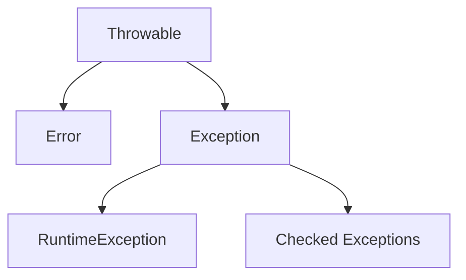

The Java Exception Hierarchy is a fundamental concept for building robust and reliable applications. It provides a structured way to categorize and handle errors and unusual events that occur during program execution.

## Table of Contents
1.  [What is an Exception?](#what-is-an-exception)
2.  [The `Throwable` Class: The Root](#the-throwable-class-the-root)
3.  [The `Error` Branch](#the-error-branch)
    *   [Example: `StackOverflowError`](#example-stackoverflowerror)
4.  [The `Exception` Branch](#the-exception-branch)
    *   [4.1. Unchecked Exceptions (`RuntimeException`)](#41-unchecked-exceptions-runtimeexception)
        *   [Example: `NullPointerException`](#example-nullpointerexception)
        *   [Example: `ArithmeticException`](#example-arithmeticexception)
    *   [4.2. Checked Exceptions](#42-checked-exceptions)
        *   [Example: `FileNotFoundException`](#example-filenotfoundexception)
5.  [Key Differences Summary](#key-differences-summary)
6.  [How to Handle Exceptions](#how-to-handle-exceptions)
    *   [`try-catch-finally`](#try-catch-finally)
    *   [`throws` Keyword](#throws-keyword)
    *   [`throw` Keyword](#throw-keyword)
7.  [Creating Custom Exceptions](#creating-custom-exceptions)
    *   [Example: `InsufficientFundsException`](#example-insufficientfundsexception)
8.  [Best Practices](#best-practices)
9.  [Conclusion](#conclusion)

---

## 1. What is an Exception?

In Java, an **exception** is an event that disrupts the normal flow of a program's instructions. When an exception occurs, the program terminates abnormally if not handled properly. The Java exception handling mechanism allows you to gracefully deal with these abnormal conditions, preventing program crashes and improving reliability.

All exceptions in Java are objects that inherit from the `java.lang.Throwable` class.

## 2. The `Throwable` Class: The Root

`java.lang.Throwable` is the superclass of all errors and exceptions in the Java language. Only objects that are instances of this class (or one of its subclasses) can be thrown by the Java Virtual Machine (JVM) or by the `throw` statement.

`Throwable` has two direct subclasses:
1.  `Error`
2.  `Exception`



## 3. The `Error` Branch

The `Error` class and its subclasses represent serious problems that a reasonable application should not try to catch. These are typically exceptional conditions that indicate something fundamental has gone wrong with the Java Virtual Machine (JVM) itself or with its environment. They are almost always unrecoverable, and catching them is generally not advised as they signify a system-level failure.

**Characteristics of `Error`:**
*   **Serious:** Indicates critical issues.
*   **Unrecoverable:** Usually not possible for the application to recover.
*   **Unchecked:** The compiler does *not* force you to handle them (no `try-catch` or `throws` required).
*   **Examples:** `OutOfMemoryError`, `StackOverflowError`, `VirtualMachineError`, `NoClassDefFoundError`.

### Example: `StackOverflowError`

This error occurs when the call stack overflows, typically due to infinite recursion without a base case.

**`StackOverflowErrorExample.java`**

```java
public class StackOverflowErrorExample {

    public static void recursiveMethod() {
        // This method calls itself indefinitely, leading to a StackOverflowError
        recursiveMethod(); 
    }

    public static void main(String[] args) {
        System.out.println("Attempting to cause a StackOverflowError...");
        try {
            recursiveMethod();
        } catch (StackOverflowError e) {
            System.err.println("Caught StackOverflowError: " + e.getMessage());
            System.err.println("This error is typically not recoverable and indicates a severe programming flaw.");
            // In a real application, you might log this and shut down.
        }
        System.out.println("Program continues after catching (though not always advisable for Errors).");
    }
}
```

**Input:**
No explicit input. Just run the program.

**Output:**
```
Attempting to cause a StackOverflowError...
Caught StackOverflowError: null
This error is typically not recoverable and indicates a severe programming flaw.
Program continues after catching (though not always advisable for Errors).
```
*(Note: The `getMessage()` for `StackOverflowError` is often `null`, but the stack trace provides the details.)*

## 4. The `Exception` Branch

The `Exception` class and its subclasses represent conditions that a reasonable application might want to catch. These are less severe than `Error` and are often recoverable. They typically represent abnormal conditions that arise from within the program or its interaction with external systems.

The `Exception` branch is further divided into two main categories:
1.  **Unchecked Exceptions** (subclasses of `RuntimeException`)
2.  **Checked Exceptions** (all other subclasses of `Exception`)

### 4.1. Unchecked Exceptions (`RuntimeException`)

These exceptions are subclasses of `java.lang.RuntimeException`. They are called "unchecked" because the Java compiler does **not** force you to catch or declare them. They often indicate programming errors (bugs) that should be fixed in the code rather than handled at runtime.

**Characteristics of `RuntimeException`:**
*   **Less Severe than `Error`:** But still often indicates a bug.
*   **Recoverable:** Sometimes, but it usually means there's a flaw in the logic.
*   **Unchecked:** The compiler does *not* force handling (no `try-catch` or `throws` required).
*   **Examples:** `NullPointerException`, `ArrayIndexOutOfBoundsException`, `ArithmeticException`, `NumberFormatException`, `IllegalArgumentException`.

### Example: `NullPointerException`

Occurs when an application attempts to use `null` in a case where an object is required, such as calling an instance method of a `null` object.

**`NullPointerExceptionExample.java`**

```java
public class NullPointerExceptionExample {

    public static void main(String[] args) {
        String text = null; // text is explicitly set to null

        System.out.println("Attempting to access length of a null string...");
        try {
            // This line will throw a NullPointerException
            int length = text.length(); 
            System.out.println("Length: " + length);
        } catch (NullPointerException e) {
            System.err.println("Caught NullPointerException: " + e.getMessage());
            System.err.println("Cause: You tried to perform an action on a variable that points to null.");
        }

        System.out.println("\nProgram continues safely after handling the exception.");
    }
}
```

**Input:**
No explicit input. Just run the program.

**Output:**
```
Attempting to access length of a null string...
Caught NullPointerException: null
Cause: You tried to perform an action on a variable that points to null.

Program continues safely after handling the exception.
```

### Example: `ArithmeticException`

Thrown when an exceptional arithmetic condition has occurred. For example, an integer "divide by zero".

**`ArithmeticExceptionExample.java`**

```java
import java.util.Scanner;

public class ArithmeticExceptionExample {

    public static void main(String[] args) {
        Scanner scanner = new Scanner(System.in);

        System.out.print("Enter numerator: ");
        int numerator = scanner.nextInt();

        System.out.print("Enter denominator: ");
        int denominator = scanner.nextInt();

        try {
            int result = numerator / denominator;
            System.out.println("Result of division: " + result);
        } catch (ArithmeticException e) {
            System.err.println("Caught ArithmeticException: " + e.getMessage());
            System.err.println("Cause: Cannot divide by zero.");
        } finally {
            scanner.close(); // Always close resources
        }

        System.out.println("\nProgram continues after handling the exception.");
    }
}
```

**Input 1 (Valid):**
```
Enter numerator: 10
Enter denominator: 2
```
**Output 1:**
```
Result of division: 5

Program continues after handling the exception.
```

**Input 2 (Invalid - will cause exception):**
```
Enter numerator: 10
Enter denominator: 0
```
**Output 2:**
```
Caught ArithmeticException: / by zero
Cause: Cannot divide by zero.

Program continues after handling the exception.
```

### 4.2. Checked Exceptions

All direct subclasses of `Exception` (except `RuntimeException` and its subclasses) are **checked exceptions**. The Java compiler **forces** you to either:
1.  **Catch** them using a `try-catch` block.
2.  **Declare** them using the `throws` keyword in the method signature.

These exceptions typically represent conditions that are outside the immediate control of the program and are expected to occur during normal operation (e.g., file not found, network issues, database errors). The compiler's enforcement helps ensure that these potential issues are addressed.

**Characteristics of `Checked Exceptions`:**
*   **External Conditions:** Often related to I/O, network, database, etc.
*   **Recoverable:** Often possible for the application to recover or provide an alternative.
*   **Checked:** The compiler *forces* handling (either `try-catch` or `throws`).
*   **Examples:** `IOException`, `FileNotFoundException`, `SQLException`, `ClassNotFoundException`.

### Example: `FileNotFoundException`

This exception is thrown when an attempt to open the file denoted by a specified pathname has failed because the file does not exist.

**`CheckedExceptionExample.java`**

```java
import java.io.File;
import java.io.FileReader;
import java.io.IOException;
import java.io.BufferedReader;

public class CheckedExceptionExample {

    public static void main(String[] args) {
        String fileName = "nonexistent_file.txt"; // This file does not exist
        // String fileName = "existing_file.txt"; // Create this file to test success

        System.out.println("Attempting to read from file: " + fileName);

        // Option 1: Handle the exception using try-catch
        try {
            readFile(fileName);
        } catch (IOException e) {
            System.err.println("\nCaught IOException in main method: " + e.getMessage());
            System.err.println("Error reading file: " + fileName);
            // Log the error, inform the user, or attempt a recovery
        }

        System.out.println("\nProgram continues after handling the file read attempt.");
    }

    // Option 2: Declare the exception using 'throws'
    // This indicates that this method might throw an IOException,
    // and the caller of this method must handle it.
    public static void readFile(String filePath) throws IOException {
        FileReader fileReader = null;
        BufferedReader bufferedReader = null;

        try {
            File file = new File(filePath);
            
            // Check if file exists before trying to read (good practice, but exception will still be thrown if not)
            if (!file.exists()) {
                // We can explicitly throw an exception here if we want a specific message,
                // or let FileReader's constructor throw FileNotFoundException
                throw new IOException("File does not exist at path: " + filePath); 
            }

            fileReader = new FileReader(file);
            bufferedReader = new BufferedReader(fileReader);

            String line;
            System.out.println("\n--- File Content ---");
            while ((line = bufferedReader.readLine()) != null) {
                System.out.println(line);
            }
            System.out.println("--- End of File ---");

        } finally {
            // Always close resources in a finally block to ensure they are closed
            // even if an exception occurs.
            try {
                if (bufferedReader != null) {
                    bufferedReader.close();
                }
                if (fileReader != null) {
                    fileReader.close();
                }
            } catch (IOException e) {
                System.err.println("Error closing resources: " + e.getMessage());
            }
        }
    }
}
```

**To test both scenarios:**

1.  **File Not Found (Default in code):**
    *   **Input:** Run the code as is. Ensure `nonexistent_file.txt` does *not* exist in the same directory.
    *   **Output:**
        ```
        Attempting to read from file: nonexistent_file.txt

        Caught IOException in main method: File does not exist at path: nonexistent_file.txt
        Error reading file: nonexistent_file.txt

        Program continues after handling the file read attempt.
        ```

2.  **File Found (Modify `fileName` variable):**
    *   **Input:** Change `String fileName = "nonexistent_file.txt";` to `String fileName = "existing_file.txt";`. Create a file named `existing_file.txt` in the same directory as your `.java` file and add some text to it (e.g., "Hello, Java!", "This is a test file.").
    *   **Output:**
        ```
        Attempting to read from file: existing_file.txt

        --- File Content ---
        Hello, Java!
        This is a test file.
        --- End of File ---

        Program continues after handling the file read attempt.
        ```

## 5. Key Differences Summary

| Feature        | `Error`                               | `Unchecked Exception` (`RuntimeException`)         | `Checked Exception`                                 |
| :------------- | :------------------------------------ | :------------------------------------------------- | :-------------------------------------------------- |
| **Parent Class** | `Throwable`                           | `RuntimeException` (which extends `Exception`)     | `Exception` (not `RuntimeException`)                |
| **Severity**   | Serious, unrecoverable JVM problems   | Less severe, usually programming errors (bugs)     | Recoverable, external conditions                    |
| **Handling**   | **Unchecked:** Do not catch. Let JVM terminate. | **Unchecked:** Compiler does not enforce handling. Fix the bug. | **Checked:** Compiler forces `try-catch` or `throws`. |
| **Cause**      | System failures, resource exhaustion  | Logical errors, invalid operations, bad input       | External factors, I/O issues, network problems      |
| **Examples**   | `OutOfMemoryError`, `StackOverflowError` | `NullPointerException`, `ArithmeticException`      | `IOException`, `SQLException`, `FileNotFoundException` |

## 6. How to Handle Exceptions

Java provides keywords to handle exceptions: `try`, `catch`, `finally`, `throws`, and `throw`.

### `try-catch-finally`

*   **`try` block:** Contains the code that might throw an exception.
*   **`catch` block:** Contains the code to execute if a specific type of exception is thrown within the `try` block. A `try` block can have multiple `catch` blocks for different exception types.
*   **`finally` block:** Contains code that will *always* execute, whether an exception occurred or not. It's often used for cleanup operations like closing resources (files, database connections).

```java
// Example from ArithmeticException above:
try {
    int result = numerator / denominator;
    System.out.println("Result of division: " + result);
} catch (ArithmeticException e) {
    System.err.println("Caught ArithmeticException: " + e.getMessage());
    System.err.println("Cause: Cannot divide by zero.");
} finally {
    // This block will execute regardless of whether an exception occurred
    scanner.close(); 
    System.out.println("Scanner closed.");
}
```

### `throws` Keyword

The `throws` keyword is used in a method signature to declare that the method *might* throw one or more checked exceptions. This tells the caller of the method that they must handle these exceptions.

```java
// Example from CheckedExceptionExample above:
public static void readFile(String filePath) throws IOException {
    // ... code that might throw IOException ...
}
```
If a method `A` calls method `B`, and method `B` declares `throws SomeCheckedException`, then method `A` must either `try-catch` `SomeCheckedException` or also declare `throws SomeCheckedException`.

### `throw` Keyword

The `throw` keyword is used to explicitly throw an instance of an exception. This is often done when you detect an error condition that you want to signal to the caller or when creating custom exceptions.

```java
// Inside readFile method:
if (!file.exists()) {
    throw new IOException("File does not exist at path: " + filePath); 
}
```

## 7. Creating Custom Exceptions

You can create your own custom exceptions to represent specific error conditions in your application's business logic.
*   To create a **checked custom exception**, extend `java.lang.Exception`.
*   To create an **unchecked custom exception**, extend `java.lang.RuntimeException`.

### Example: `InsufficientFundsException`

Let's say we're building a banking application and want to throw a specific exception when a withdrawal exceeds the available balance.

**`InsufficientFundsException.java`** (Custom Checked Exception)

```java
public class InsufficientFundsException extends Exception {
    private double currentBalance;
    private double withdrawalAmount;

    public InsufficientFundsException(String message, double currentBalance, double withdrawalAmount) {
        super(message);
        this.currentBalance = currentBalance;
        this.withdrawalAmount = withdrawalAmount;
    }

    public double getCurrentBalance() {
        return currentBalance;
    }

    public double getWithdrawalAmount() {
        return withdrawalAmount;
    }
}
```

**`BankAccount.java`**

```java
public class BankAccount {
    private double balance;

    public BankAccount(double initialBalance) {
        if (initialBalance < 0) {
            throw new IllegalArgumentException("Initial balance cannot be negative.");
        }
        this.balance = initialBalance;
    }

    public double getBalance() {
        return balance;
    }

    // Method that declares throwing a custom checked exception
    public void withdraw(double amount) throws InsufficientFundsException {
        if (amount < 0) {
            throw new IllegalArgumentException("Withdrawal amount cannot be negative.");
        }
        if (balance < amount) {
            throw new InsufficientFundsException(
                "Insufficient funds for withdrawal.", 
                balance, 
                amount
            );
        }
        balance -= amount;
        System.out.printf("Successfully withdrew %.2f. New balance: %.2f%n", amount, balance);
    }

    public void deposit(double amount) {
        if (amount < 0) {
            throw new IllegalArgumentException("Deposit amount cannot be negative.");
        }
        balance += amount;
        System.out.printf("Successfully deposited %.2f. New balance: %.2f%n", amount, balance);
    }
}
```

**`CustomExceptionExample.java`** (Main class to test)

```java
import java.util.Scanner;

public class CustomExceptionExample {

    public static void main(String[] args) {
        Scanner scanner = new Scanner(System.in);
        BankAccount myAccount = new BankAccount(100.00); // Start with $100

        System.out.println("Current balance: " + myAccount.getBalance());

        System.out.print("Enter withdrawal amount: ");
        double amountToWithdraw = scanner.nextDouble();

        try {
            myAccount.withdraw(amountToWithdraw);
        } catch (InsufficientFundsException e) {
            System.err.println("\nTransaction failed: " + e.getMessage());
            System.err.printf("Details: Current Balance: %.2f, Attempted Withdrawal: %.2f%n",
                              e.getCurrentBalance(), e.getWithdrawalAmount());
        } catch (IllegalArgumentException e) {
            System.err.println("\nError: " + e.getMessage());
        } finally {
            scanner.close();
            System.out.println("Program finished.");
        }
    }
}
```

**Input 1 (Successful Withdrawal):**
```
Current balance: 100.0
Enter withdrawal amount: 50
```
**Output 1:**
```
Successfully withdrew 50.00. New balance: 50.00
Program finished.
```

**Input 2 (Insufficient Funds):**
```
Current balance: 100.0
Enter withdrawal amount: 150
```
**Output 2:**
```
Transaction failed: Insufficient funds for withdrawal.
Details: Current Balance: 100.00, Attempted Withdrawal: 150.00
Program finished.
```

**Input 3 (Invalid Amount - Unchecked Exception):**
```
Current balance: 100.0
Enter withdrawal amount: -20
```
**Output 3:**
```
Error: Withdrawal amount cannot be negative.
Program finished.
```
*(Note: `IllegalArgumentException` is a `RuntimeException`, so it doesn't *have* to be caught, but catching it here demonstrates how to handle multiple exception types.)*

## 8. Best Practices

*   **Be Specific in `catch` Blocks:** Catch specific exceptions before catching more general ones (`Exception`). This allows for more precise error handling.
*   **Don't Just Catch and Ignore:** An empty `catch` block hides errors and makes debugging difficult. Always log or handle the exception in some meaningful way.
*   **Use `finally` for Resource Cleanup:** Ensure resources (files, network connections, database connections) are closed, even if an exception occurs.
*   **Log Exceptions:** Use a logging framework (like Log4j or SLF4J) to record exception details for debugging and monitoring.
*   **Don't Hide the Original Exception:** When re-throwing an exception or wrapping it in a new one, always pass the original exception as the cause using `initCause()` or a constructor that accepts a `Throwable cause`.
*   **Fail Fast:** If an error condition makes further execution meaningless, throw an exception immediately.
*   **Document `throws` Clauses:** Clearly document the exceptions a method can throw in its Javadoc.
*   **Avoid Catching `Error`:** `Error` usually indicates severe system problems that your application cannot recover from.

## 9. Conclusion

The Java Exception Hierarchy provides a robust and organized system for managing runtime anomalies. Understanding the differences between `Error`, `Checked Exceptions`, and `Unchecked Exceptions` is crucial for writing reliable, maintainable, and robust Java applications. Proper exception handling allows your programs to recover from errors gracefully, provide meaningful feedback to users, and maintain stability even in the face of unexpected events.